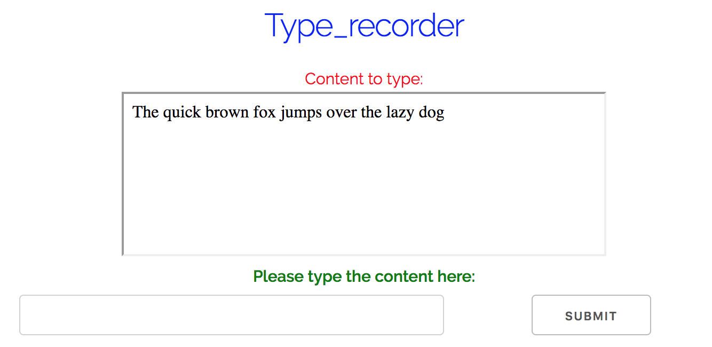

# Type_recorder
1. Dependencies:
	- Python 3.6.4 :: Anaconda, Inc
	- Dash (https://plot.ly/products/dash/)
2. User Guide:
	1. What's Type_recorder
		- Type_recorder is a web server that record users' speed and accuracy typing sample texts.
	2. How to run
		1. Check Dependencies
		2. Type in `python type_recorder.py` in terminal
		3. The server will be running on local host (for example http://127.0.0.1:8050/)
		4. Copy the http address to your browser to access to the user interface
		5. When done with all sample texts, run post_processing.py to evaluate user typed content
		6. The final records is in a csv file named *records.csv*
	3. How to interpret records
		- *records.csv* has 5 columns, namely, test id (implicit), duration, user input, reference content and mistakes
		- **test id** refers to the index of test, each test asks user to type in a sentence according to the reference
		- **duration** how long did it take for the user to type this sentence
		- **user input** the content that user typed in
		- **reference content** the reference content the user referred to
		- **mistakes** *Levenshtein* distance between user input and the reference
	4. Screenshot of the UI
		- 
